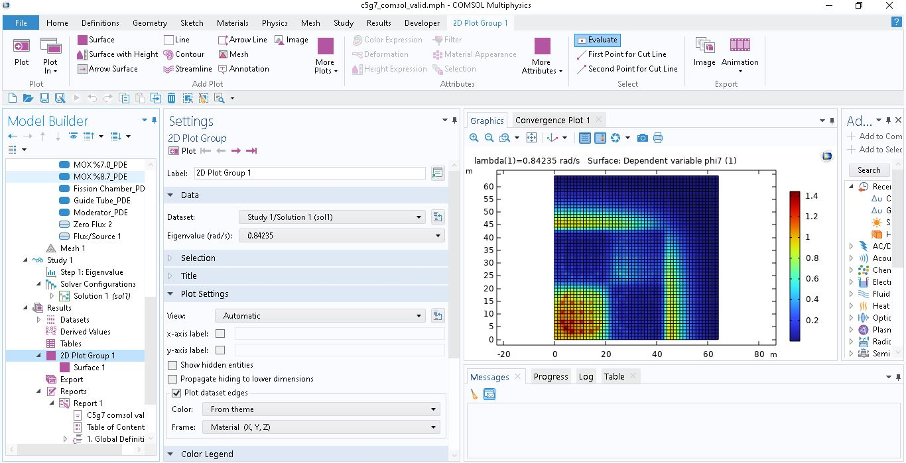

# OECD-NEA C5G7 Benchmark — COMSOL Multiphysics Analysis

> 7-group neutron diffusion solution of the OECD/NEA C5G7 benchmark using COMSOL Multiphysics Coefficient Form PDE.

## Result

| Quantity | This Work | Reference |
|----------|-----------|-----------|
| k-eff | **1.1873** | 1.18655 ± 3 pcm |
| Deviation | ~6 pcm | — |

## About the C5G7 Benchmark

The C5G7 benchmark is an OECD/NEA reactor physics problem designed to test transport and diffusion solvers without spatial homogenization. It consists of a 2D quarter-core configuration with:

- UO₂ and MOX fuel assemblies (4.3%, 7.0%, 8.7% Pu content)
- Fission chamber and guide tube cells
- Water moderator reflector
- 7 energy groups

Reference: *NEA/NSC/DOC(2003)16*

## Methodology

The 7-group multigroup neutron diffusion equation is solved in COMSOL using the **Coefficient Form PDE** interface:

```
-∇·(Dg ∇φg) + Σrem,g φg - Σs,g'→g φg' = (1/keff) χg Σg' νΣf,g' φg'
```

Reformulated as an eigenvalue problem with λ = 1/keff:

```
-∇·(c∇φ) + a·φ = f(λ)
```

where the fission source `f = λ · χ · νΣf · φ` is placed in the source term with `da = 0`.

### Key Formulation Notes

- **Eigenvalue placement:** `lambda` (λ) enters as a multiplier in the `f` (source) term — NOT in `da` (damping/mass coefficient). Placing fisyon source in `da` yields unphysical complex eigenvalues.
- **da matrix:** All entries set to zero for a steady-state criticality problem.
- **ea matrix:** All entries set to zero (no second-order time derivative).
- **Unit:** Eigenvalue study unit set to dimensionless `1` to avoid rad/s conflicts.
- **Absorption matrix (a):** Diagonal = `Srem`, off-diagonal upscatter terms = `-Ss` (negative). Downscatter goes into `f`.
- **Boundary conditions:** Zero flux (φ = 0) on all outer boundaries.

## Materials

| Region | Material | Groups |
|--------|----------|--------|
| UO2_PDE | UO₂ fuel | 7 |
| MOX%4.3_PDE | MOX 4.3% | 7 |
| MOX%7.0_PDE | MOX 7.0% | 7 |
| MOX%8.7_PDE | MOX 8.7% | 7 |
| Fission_Chamber_PDE | Fission chamber | 7 |
| Guide_Tube_PDE | Guide tube | 7 |
| Moderator_PDE | Water reflector | 7 |

## Software

- COMSOL Multiphysics 6.0 — Coefficient Form PDE
- Eigenvalue solver: ARPACK
- DOF: ~147,091
## Pictures (phi1-phi7)


## References

- OECD/NEA, *Benchmark on Deterministic Transport Calculations Without Spatial Homogenisation*, NEA/NSC/DOC(2003)16
- Cosgrove et al., *C5G7 with Serpent 2*, PHYSOR 2022 Munich — keff = 1.18678 ± 14 pcm
